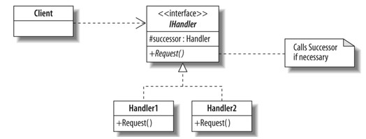

# Chain-of-responsibility pattern

The chain-of-responsibility pattern is a design pattern consisting of a source of command objects and a series of processing objects.

[Wikipedia](http://en.wikipedia.org/wiki/Chain-of-responsibility_pattern)

Intent
-----------------------------------

- Avoid coupling the sender of a request to its receiver by giving more than one object a chance to handle the request 
- Chain the receiving objects and pass the request along the chain until an object handles it
- Launch-and-leave requests with a single processing pipeline that contains many possible handlers
- An object-oriented linked list with recursive traversal

# Examples

- [SourceMaking](http://sourcemaking.com/design_patterns/chain_of_responsibility)

# UML

