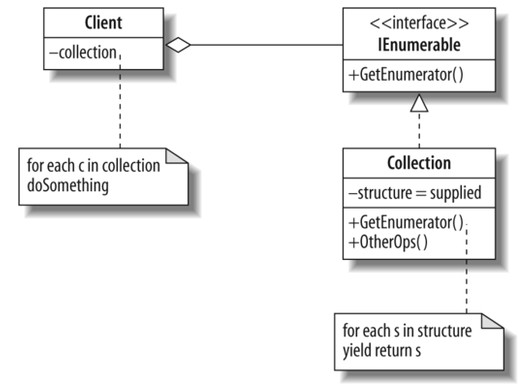

Iterator pattern
=======================

he command pattern is a behavioral design pattern in which an object is used to encapsulate all information needed to perform an action or trigger an event at a later time.

[Wikipedia](https://en.wikipedia.org/wiki/Command_pattern)

UML
-----------------------

