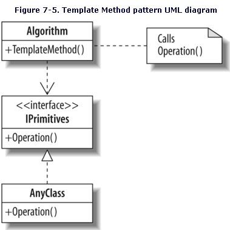

Template pattern
======================================

In the Template Pattern an abstract class will define a method with an algorithm, and methods which the algorithm will use.
The methods the algorithm uses can be either required or optional. The optional method should by default do nothing.

The Template Pattern is unusual in that the Parent class has a lot of control.

UML
--------------------------------------

