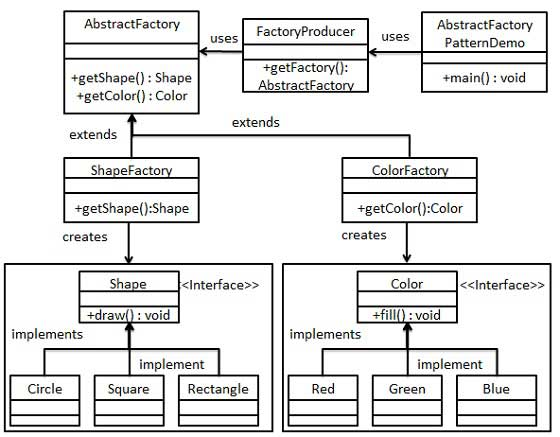

Abstract Factory
================================

Provide an interface for creating families of related or dependent objects without specifying their concrete classes.

Resources
--------------------------------

[Wikipedia](http://en.wikipedia.org/wiki/Abstract_factory)

Running the example
--------------------------------

	javac -g AbstractFactoryPatternDemo.java
	java AbstractFactoryPatternDemo

UML
--------------------------------

