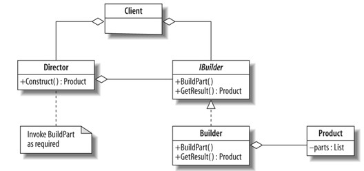

Builder Pattern
=================

In the Builder Pattern a director and a builder work together to build an object.
The director controls the building and specifies what parts and variations will go into an object.
The builder knows how to assemble the object given specification.

Resources
-----------------

[Wikipedia](http://en.wikipedia.org/wiki/Builder_pattern)

UML
-----------------

