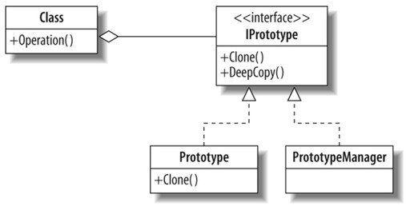

Prototype pattern
================================

In the Prototype pattern we create one standard object for each class, and clone that object to create new instances.

Prototype pattern refers to creating duplicate object while keeping performance in mind.

UML
---------------------------------
