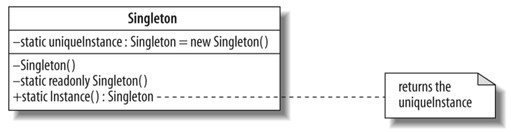

Singleton pattern
======================

In the singleton pattern a class can distribute one instance of itself to other classes.

Singleton is often considered an Anti-pattern! Many people does not consider singleton as a design pattern.

[Singleton on Wikipedia](http://en.wikipedia.org/wiki/Singleton_pattern)

UML
----------------------

