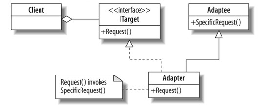

Adapter pattern
=====================================

Adapter pattern works as a bridge between two incompatible interfaces.
It is often used to make existing classes work with others without modifying their source code.

This pattern involves a single class which is responsible to join functionalities of independent or incompatible interfaces. 
A real life example could be a case of card reader which acts as an adapter between memory card and a laptop. 
You plugin the memory card into card reader and card reader into the laptop so that memory card can be read via laptop.

Resources
-------------------------------------

- [Wikipedia](http://en.wikipedia.org/wiki/Adapter_pattern)

UML
-------------------------------------

