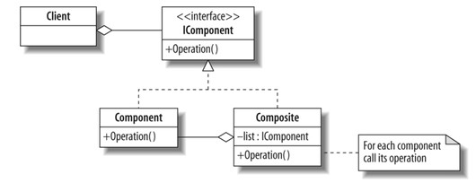

Composite pattern
====================

The composite pattern is a partitioning design pattern.
It describes that a group of objects is to be treated in the same way as a single instance of an object. 
The intent of a composite is to "compose" objects into tree structures to represent part-whole hierarchies.
Implementing the composite pattern lets clients treat individual objects and compositions uniformly.

- [Wikipedia](https://en.wikipedia.org/wiki/Composite_pattern)

UML
-------------------

