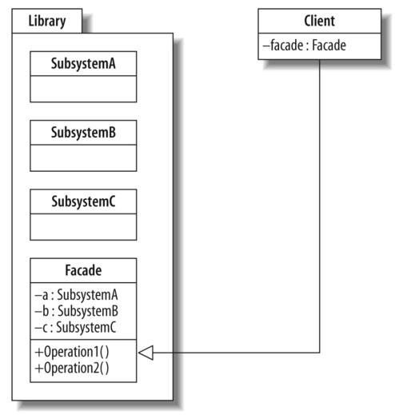

FACADE PATTERN
==================

A facade is an object that provides a simplified interface to a larger body of code, such as a class library.

A facade can:
- make a software library easier to use, understand, and test since the facade has convenient methods for common tasks;
- make the library more readable, for the same reason;
- reduce dependencies of outside code on the inner workings of a library, since most code uses the facade allowing more flexibility in developing a system;
- wrap a poorly designed collection of APIs with a single well-designed API;

[http://en.wikipedia.org/wiki/Facade_pattern](http://en.wikipedia.org/wiki/Facade_pattern)

UML
------------------

