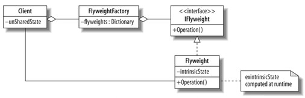

Flyweight pattern
=========================

In the flyweight pattern instances of a class which are identical are shared in an implementation instead of creating a new instance of that class for every instance. 

This is done largely to assist performance, and works best when a large number of the exact same instance of a class would otherwise be created.

UML
------------------------
 
